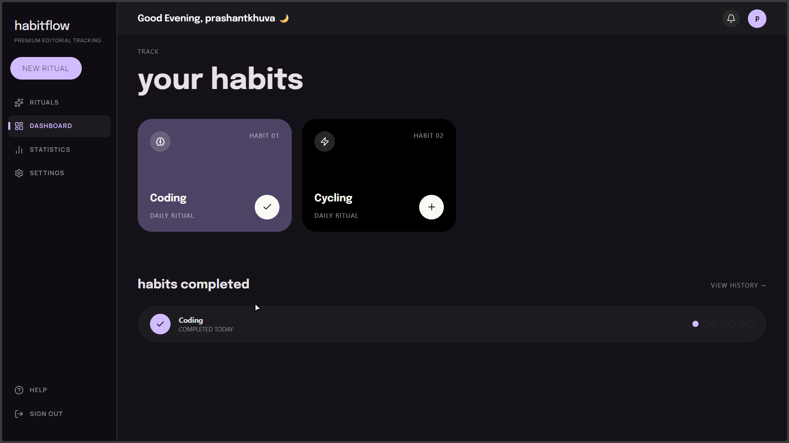
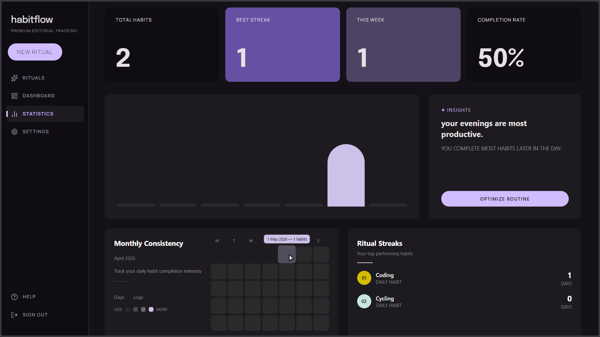
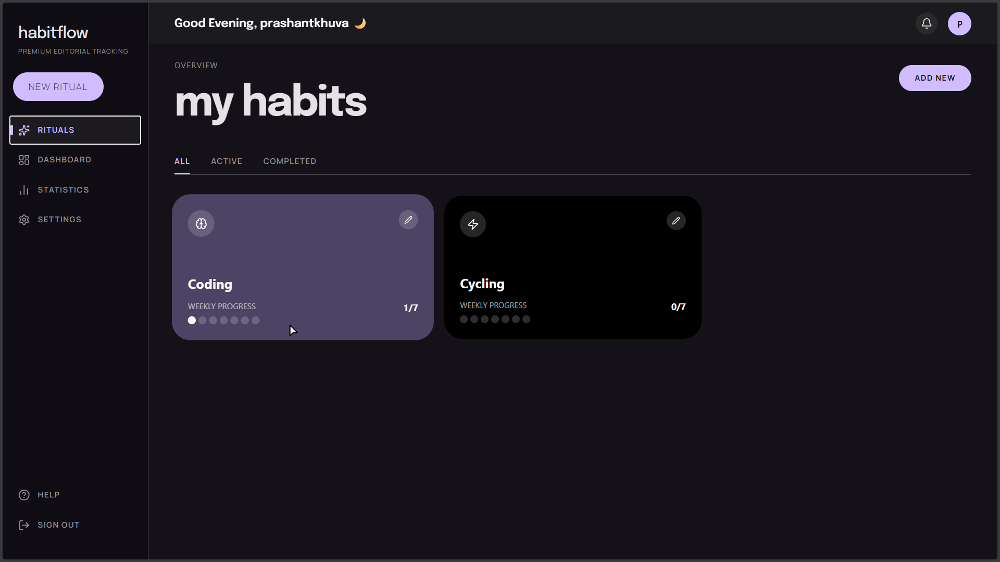
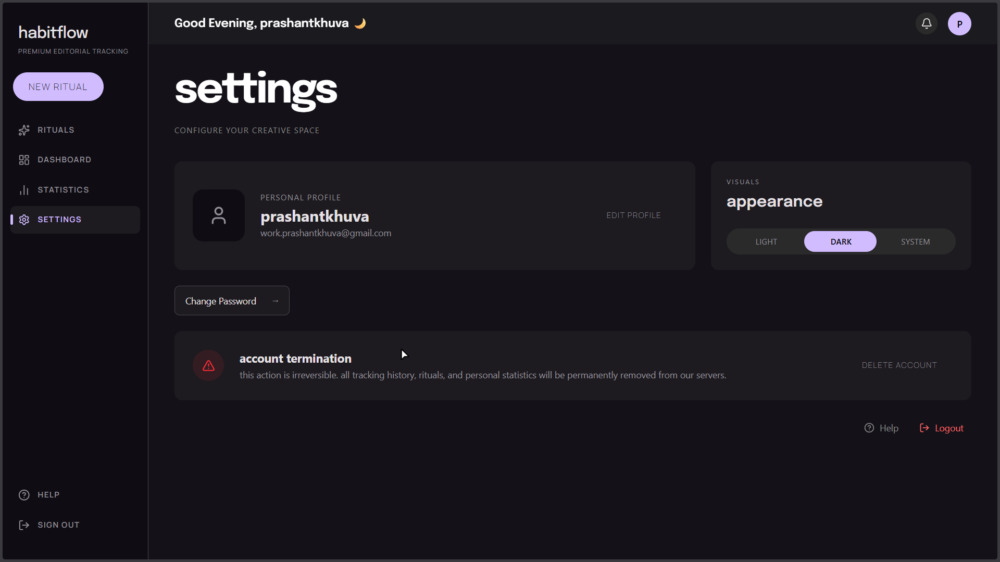
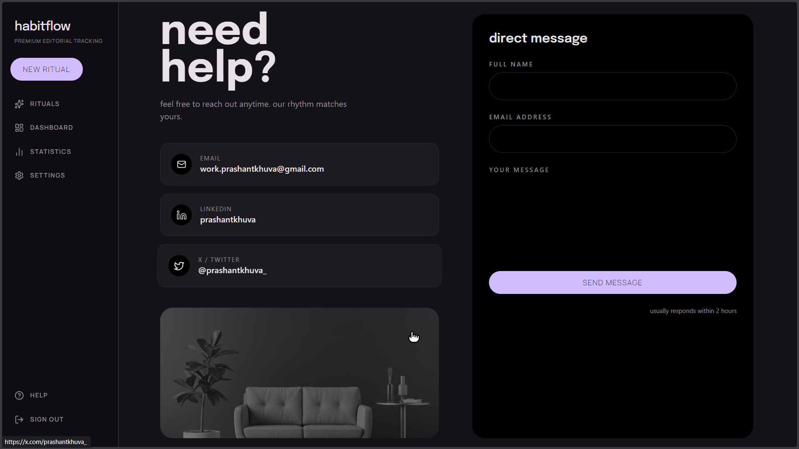

# 🧠 HabitFlow — Editorial Habit Tracker

A modern, minimal and aesthetic habit tracking web app designed to turn daily routines into a **creative ritual**.

🌐 **Live App:** https://habitflow.indevs.in/

---

## ✨ Overview

HabitFlow is not just a habit tracker — it's a **design-driven experience** focused on clarity, consistency, and visual feedback.

Built with a clean editorial UI, smooth animations, and powerful backend logic, it helps users track habits, analyze progress, and stay consistent.

---

## 🚀 Features

### 🔐 Authentication

- Secure login & signup (JWT-based)
- Cookie-based session handling
- Protected routes

### 📊 Habit Management

- Create, update, delete habits
- Active / Completed habit states
- Category & color-based organization

### 📈 Analytics & Insights

- Weekly chart visualization
- Monthly heatmap tracking
- Best month detection
- Streak tracking system

### 🎨 UI / UX

- Editorial design system
- Fully responsive (mobile-first)
- Smooth animations using Framer Motion
- Clean component architecture

### 🌗 Theme System

- Light / Dark mode
- System theme detection
- Persistent theme preference

### ⚙️ Settings

- Edit profile
- Change password (secure flow)
- Logout & account deletion

### 📩 Help & Contact

- Integrated contact form (Formspree)
- External links (LinkedIn, X)

---

## 🛠 Tech Stack

### Frontend

- React.js (Vite)
- Tailwind CSS
- Framer Motion
- Redux Toolkit
- React Router

### Backend

- Node.js
- Express.js
- MongoDB (Mongoose)
- JWT Authentication

### Deployment

- Frontend: Vercel
- Backend: (Render / Railway / Custom)

---

## 📁 Project Structure

```
client/
  ├── components/
  ├── pages/
  ├── store/
  ├── api/
  └── utils/

server/
  ├── controllers/
  ├── routes/
  ├── models/
  ├── middlewares/
  └── validators/
```

---

## 📸 Screenshots

### Dashboard



### Static



### Rituals



### Settings



### Help



---

## ⚡ Getting Started

### 1. Clone the repo

```bash
git clone https://github.com/Prashantkhuva/HABIT-TRACKER-FRONTEND.git
cd habitflow
```

### 2. Install dependencies

```bash
npm install
```

### 3. Setup environment variables

Create a `.env` file:

```env
PORT=5000
MONGO_URI=your_mongodb_uri
ACCESS_TOKEN_SECRET=your_secret
REFRESH_TOKEN_SECRET=your_secret
```

### 4. Run the app

```bash
npm run dev
```

---

## 🔐 API Endpoints (Overview)

- `POST /users/register`
- `POST /users/login`
- `POST /users/logout`
- `GET /users/current-user`
- `POST /users/change-password`
- `PATCH /users/update-details`
- `DELETE /users/delete-account`

---

## 💡 Learnings

- Built full authentication system with JWT
- Implemented scalable component architecture
- Designed a consistent UI system for light & dark themes
- Created data visualization (heatmaps & charts)
- Improved UX with animation & micro-interactions

---

## 🧑‍💻 Author

**Prashant Khuva**

- LinkedIn: https://www.linkedin.com/in/prashantkhuva
- X (Twitter): https://x.com/prashantkhuva_

---

## ⭐ Support

If you like this project, consider giving it a ⭐ on GitHub!

---
